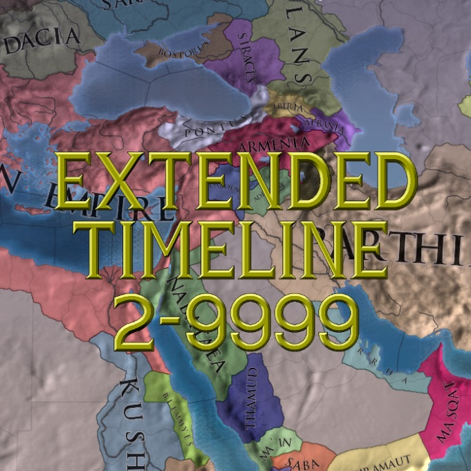

# Extended Timeline Chinese Localisation Project



Translated version of a EU4 mod called "Extended Timeline".

「Extended Timeline」模组的中文汉化整合版

[ParaTranz 项目](https://paratranz.cn/projects/5342/)

## 下载 & 使用 / Download & Use

你可以在 [Actions 构建](https://github.com/Cccc-owo/Extended-Timeline-Chinese-Localisation-Project/actions)中下载到本地版 Mod，或者你也可以在 [Steam 创意工坊](https://steamcommunity.com/sharedfiles/filedetails/?id=2897275182)中找到本 Mod。

注意：**请不要将本 Mod 与「汉化 Mod」或原版「Extended Timeline」一起使用，本 Mod 已将汉化和 ET 整合。**

## 文件夹结构说明 / Folders structure of the repository

|文件夹 / folder|内容 / contents|备注 / notes|
|--------------|---------------|-----------|
|.github|GitHub 工作流文件||
|addition|整合过程最后需要覆盖的东西|存放有额外加入的文件|
|cn_text|翻译后的文本文件|使用 EU4 双字节补丁特殊编码|
|eu4_chinese|52汉化组欧陆风云 4 简体中文汉化|[源项目](https://paratranz.cn/projects/2)|
|eu4_chinese|52汉化组欧陆风云 4 简体中文汉化|[源项目](https://paratranz.cn/projects/2)|
|ExtendedTimeline|ET 源文件|包含整个 mod|
|mod_descriptor|mod 描述符文件||
|output|输出文件夹|运行 ```main.bat``` 时会自动建立|

```7z.exe``` 和 ```7z.dll``` 提取自官方 7-Zip 22.01 (2022-07-15) 
