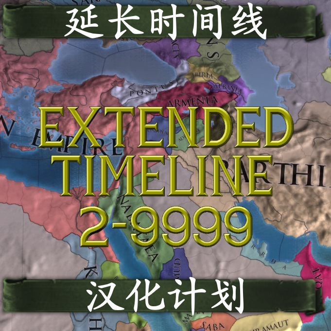

# 延长时间线汉化计划－Extended Timeline Chinese Localisation Project

[](https://paratranz.cn/projects/5342)

[](https://github.com/Cccc-owo/Extended-Timeline-Chinese-Localisation-Project/releases)
[](https://steamcommunity.com/sharedfiles/filedetails/?id=2897275182)
[](https://steamcommunity.com/sharedfiles/filedetails/?id=2897275182)
[](https://github.com/Cccc-owo/Extended-Timeline-Chinese-Localisation-Project/tags)
[](https://github.com/Cccc-owo/Extended-Timeline-Chinese-Localisation-Project/graphs/commit-activity)

「Extended Timeline」模组的中文汉化子模组

[ParaTranz 项目](https://paratranz.cn/projects/5342/)

[开发指南](DEV.md)

## 下载 & 使用 / Download & Use

你可以在 [Releases](https://github.com/Cccc-owo/Extended-Timeline-Chinese-Localisation-Project/releases) 中下载到本地版 Mod，或者你也可以在 [Steam 创意工坊](https://steamcommunity.com/sharedfiles/filedetails/?id=2897275182)中找到本 Mod。

<details><summary>本地版使用教程</summary>

~~下载 [Releases](https://github.com/Cccc-owo/Extended-Timeline-Chinese-Localisation-Project/releases/latest) 中的 ```mod.zip```，原样解压 ```mod.zip``` 至 ```文档 > Paradox Interactive > Europa Universalis IV > mod``` 目录下。打开启动器 ```dowser.exe```（正版玩家直接启动游戏相当于打开启动器），在**边栏**的**播放集**一页中，点击右上角的**添加更多 MOD**，将本模组加入播放集。接着确保本模组启用的情况下，关闭其他不兼容的模组（如原版汉化模组、Extended Timeline及其他修改较大的模组），返回主页开始游戏即可。~~

等待更新...

</details>

注意：**请不要将本 Mod 与「汉化 Mod」一起使用，本 Mod 已整合原版汉化，但需要和 ET 一起运行。**

## 文件夹结构说明 / Folders structure of the repository

|文件夹 / folder|内容 / contents|备注 / notes|
|--------------|---------------|-----------|
|[.github](.github)|GitHub 工作流文件||
|[addition](addition)|整合过程最后需要覆盖的东西|存放有额外加入的文件|
|[cn_text](cn_text)|翻译后的文本文件|使用 EU4 双字节补丁特殊编码，[源项目](https://paratranz.cn/projects/5342/)|
|[eu4_chinese](eu4_chinese)|52汉化组欧陆风云 4 简体中文汉化|[源项目](https://paratranz.cn/projects/2)|
|[eu4_chinese_sup](eu4_chinese_sup)|52汉化组欧陆风云 4 简体中文汉化补充包|[源项目](https://paratranz.cn/projects/2)|
|[ExtendedTimeline](ExtendedTimeline)|ET 源文件|[Paradox Forum](https://forum.paradoxplaza.com/forum/threads/mod-extended-timeline.740866/)|
|[mod_descriptor](mod_descriptor)|mod 描述符文件||
|output|输出文件夹|运行 ```main.bat``` 时会自动建立|

```7z.exe``` 和 ```7z.dll``` 提取自官方 7-Zip 22.01 (2022-07-15)

```wget.exe``` 版本 v1.21.3

## 贡献者 / Contributors

排名以加入项目时间为顺序

|[](https://github.com/Cccc-owo)|[](https://github.com/shuaichao189)|[](https://github.com/Zhujianfei1)|[](https://github.com/CHuang227)|[](https://github.com/Fritzwang)|
|---------------------------------------------------------------------|---------------------------------------------------------------------|---------------------------------------------------------------------|---------------------------------------------------------------------|---------------------------------------------------------------------|
|[Cccc_](https://github.com/Cccc-owo) ([ParaTranz](https://paratranz.cn/users/23550/profile))|[shuaichao189](https://github.com/shuaichao189) ([ParaTranz](https://paratranz.cn/users/7232/profile))|[Zhujianfei](https://github.com/Zhujianfei1) ([ParaTranz](https://paratranz.cn/users/26954/profile))|[CHuang227](https://github.com/CHuang227) ([ParaTranz](https://paratranz.cn/users/32894/profile))|[Fritzwang](https://github.com/Fritzwang) ([ParaTranz](https://paratranz.cn/users/37160/profile))
|[](https://github.com/15910637182)|[](https://github.com/IsaacChen0527)|[](https://github.com/zhuxizheng)|[](https://github.com/Observl)|[](https://github.com/Cloudflipper)|
|[15910637182](https://github.com/15910637182) ([ParaTranz](https://paratranz.cn/users/37197/profile))|[IsaacChen0527](https://github.com/IsaacChen0527) ([ParaTranz](https://paratranz.cn/users/37202/profile))|[zhuxizheng](https://github.com/zhuxizheng) ([ParaTranz](https://paratranz.cn/users/20486/profile))|[Observl](https://github.com/Observl) ([ParaTranz](https://paratranz.cn/users/37218/profile))|[Cloudflipper](https://github.com/Cloudflipper) ([ParaTranz](https://paratranz.cn/users/37269/profile))|

## 鸣谢 / Credits

[Europa Universalis IV 52 汉化组](https://paratranz.cn/projects/2)

[原 Extended Timeline 汉化项目](https://paratranz.cn/projects/32)

[Extended Timeline 日化项目](https://paratranz.cn/projects/148)

[Extended Timeline 1.29.5 个人汉化项目](https://paratranz.cn/projects/881)
